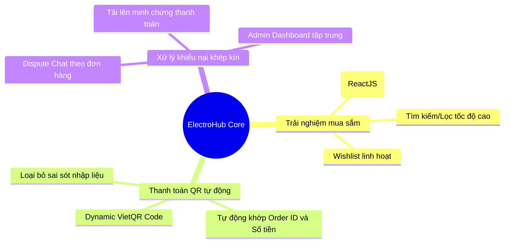
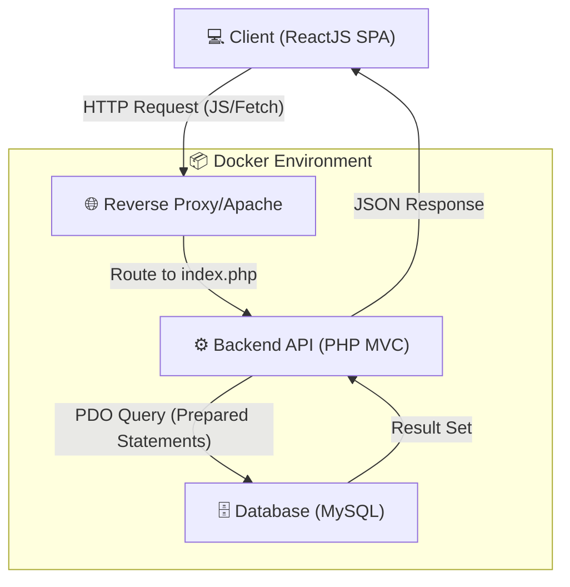
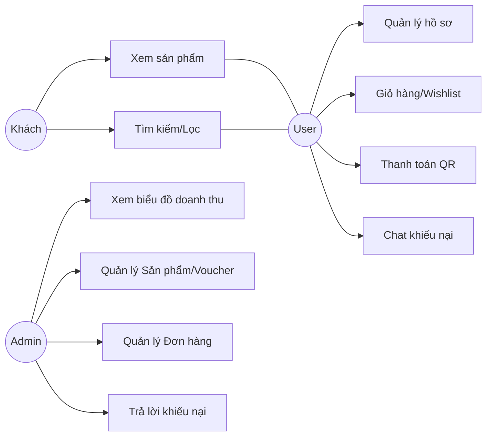
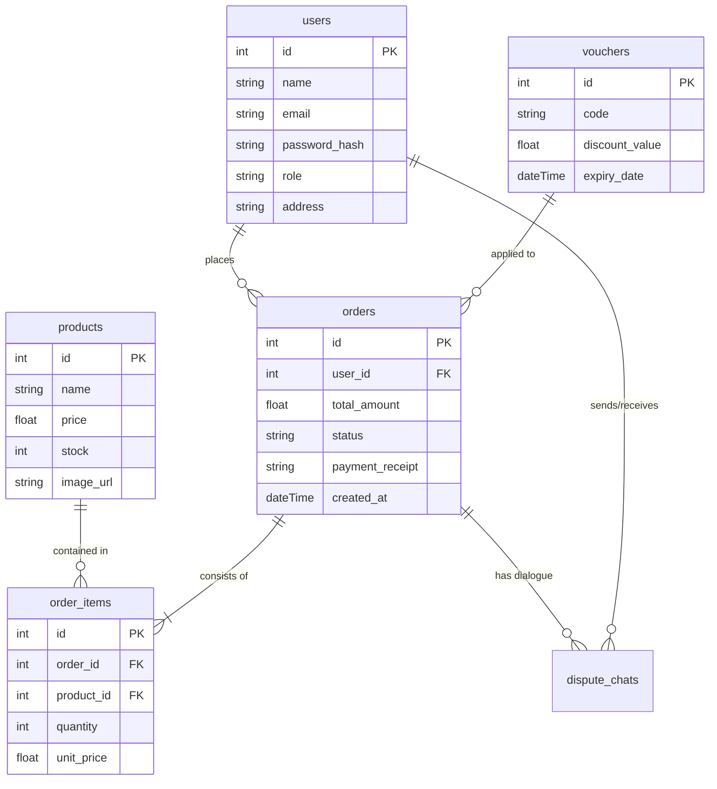
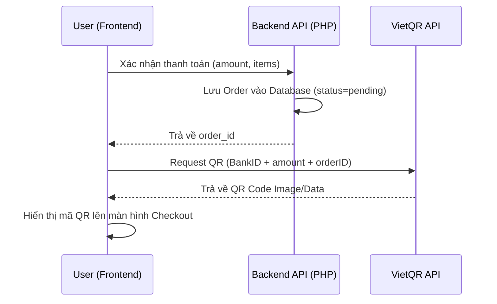
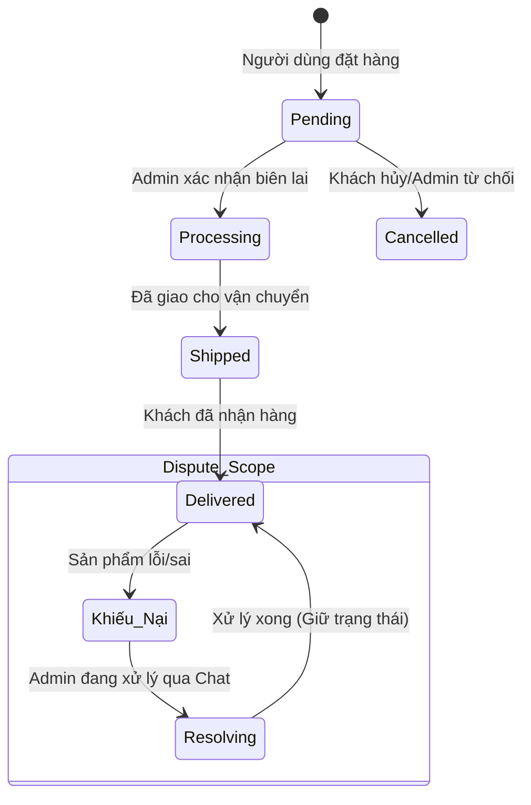
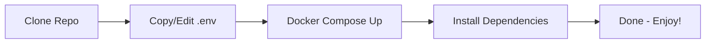
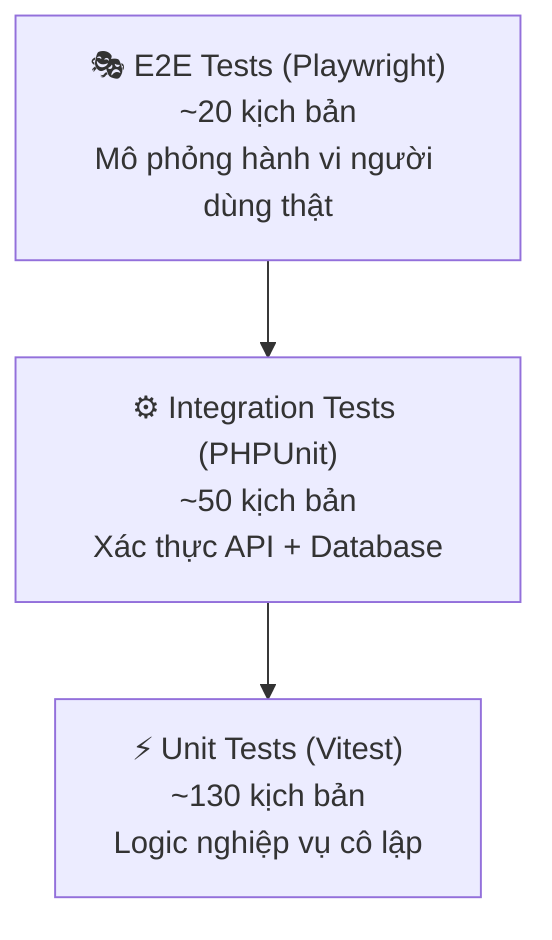

# TRƯỜNG ĐẠI HỌC [TÊN TRƯỜNG CỦA BẠN]
## KHOA CÔNG NGHỆ THÔNG TIN
-----***-----

# 🛒 NỀN TẢNG THƯƠNG MẠI ĐIỆN TỬ ELECTROHUB
### TỐI ƯU HÓA TRẢI NGHIỆM MUA SẮM VÀ QUY TRÌNH THANH TOÁN QR ĐỘNG

**Sinh viên thực hiện:** Ngô Văn Đại  
**Lớp:** [Tên Lớp]  
**Giảng viên hướng dẫn:** [Tên Giảng Viên]

---

## 1. 🌟 Tổng quan dự án (Overview)

ElectroHub là một nền tảng thương mại điện tử hiện đại, chuyên biệt cho các thiết bị công nghệ. Dự án tập trung vào việc giải quyết các điểm nghẽn trong thanh toán và khiếu nại bằng cách tích hợp **VietQR động** và hệ thống **Dispute Chat** khép kín.

### 🎯 3 Giá trị cốt lõi


---

## 2. 🏗️ Kiến trúc Hệ thống (System Architecture)

Dự án được triển khai theo kiến trúc **Client-Server** hiện đại, tất cả các thành phần đều được Container hóa bằng **Docker** để đảm bảo tính nhất quán trên mọi môi trường.

**Tech Stack:**
- **Frontend:** ReactJS 18+, Vite, Tailwind CSS, Lucide Icons.
- **Backend:** PHP 8 MVC, PDO (Security-First), JWT Authentication.
- **Database:** MySQL 8.x (ACID Compliance).
- **DevOps:** Docker, Docker Compose.

### 🔄 Luồng dữ liệu kỹ thuật


---

## 3. 👥 Tác nhân và Phân quyền (Use Case & Features)

Hệ thống phân chia 3 cấp độ người dùng với các quyền hạn riêng biệt:

- **Khách vãng lai (Guest):** Xem sản phẩm, dùng bộ lọc, tìm kiếm.
- **Người dùng (User):** Quản lý giỏ hàng, Wishlist, thanh toán QR, tải biên lai, chat khiếu nại.
- **Quản trị viên (Admin):** Quản lý sản phẩm, đơn hàng, khách hàng, voucher, phân tích biểu đồ doanh thu.

### 🎭 Sơ đồ Use Case


---

## 4. 🗄️ Thiết kế Cơ sở dữ liệu (Database Schema)

Cơ sở dữ liệu được thiết kế theo mô hình quan hệ (RDBMS) để đảm bảo tính toàn vẹn dữ liệu cho các giao dịch tài chính.

### 📊 Sơ đồ thực thể liên kết (ERD)


---

## 5. ⚡ Luồng nghiệp vụ cốt lõi (Core Business Flows)

### 💳 Luồng Thanh toán QR động
User không cần nhập tay thông tin chuyển khoản. Hệ thống tự động sinh mã QR chứa chính xác số tiền và nội dung đơn hàng.



### 📦 Vòng đời đơn hàng (Order Lifecycle)


---

## 6. 🚀 Hướng dẫn Cài đặt và Triển khai (Getting Started)

### Các bước thực hiện:

1. **Clone project:**
   ```bash
   git clone https://github.com/ngovandai/electrohub.git
   cd electrohub
   ```

2. **Cấu hình môi trường:**
   - Tạo file `.env` trong thư mục `backend/` dựa trên `.env.example`.
   - Cấu hình thông tin DB: `DB_HOST=mysql`, `DB_USER=ecommerce_user`, `DB_PASS=secret123`.

3. **Khởi chạy container:**
   ```bash
   docker-compose up -d --build
   ```

4. **Truy cập:**
   - **Frontend:** `http://localhost:5180`
   - **Backend API:** `http://localhost:8888`
   - **phpMyAdmin:** `http://localhost:8081`

### 🛠️ Lộ trình triển khai cục bộ


---

## 7. 🧪 Kiểm thử Hệ thống (System Testing)

Dự án áp dụng **Mô hình Tháp Kiểm thử (Testing Pyramid)** với 3 cấp độ, đảm bảo 200 kịch bản được kiểm tra từ Đơn vị đến Toàn trình.



### ▶️ Lệnh chạy test

| Cấp độ | Công cụ | Lệnh |
|---|---|---|
| Unit + Integration Frontend | Vitest | `cd E-Commerce && npm run test:unit` |
| E2E (Có ghi hình) | Playwright | `cd E-Commerce && npx playwright test` |
| Backend API | PHPUnit | `docker exec php-apache vendor/bin/phpunit -c phpunit.xml` |

---

### ⚡ [UNIT] Tính toán Logic Thanh toán (CheckoutLogic)

**Mục đích:** Kiểm tra các hàm tính toán nghiệp vụ cốt lõi: phí vận chuyển, giá trị voucher, tổng đơn hàng — hoàn toàn độc lập với UI và Database.

**Cách thực hiện:**
1. `Arrange` — Tạo dữ liệu giả (mock): danh sách items, khu vực vận chuyển `hanoi`, mã voucher `SUMMER20`.
2. `Act` — Gọi trực tiếp hàm `calculateShipping('hanoi')` và `applyVoucher(voucher, subtotal)`.
3. `Assert` — Kiểm tra: phí ship = `20.000đ`, discount = `20%` subtotal, tổng = `subtotal + ship - discount`.

**API Endpoints liên quan:** *(Unit test không gọi API — kiểm tra pure functions)*

**📁 File test:** [`tests/frontend/Unit/CheckoutLogic.test.tsx`](tests/frontend/Unit/CheckoutLogic.test.tsx)

---

### ⚙️ [INTEGRATION] Luồng Xác thực & Đặt hàng (PHPUnit)

**Mục đích:** Đảm bảo luồng HTTP Request từ client tác động đúng lên Database: đăng nhập → tạo đơn hàng → xác nhận rollback sạch dữ liệu.

**Cách thực hiện:**
1. `POST /api/auth/login` với `{ email, password }` → Assert Status `200`, nhận `token`.
2. `POST /api/user/checkout` kèm `Authorization: Bearer <token>` với payload giỏ hàng đầy đủ.
3. Assert response Status = `201`, body chứa `order_id` và `total_amount` chính xác.
4. Sau test: `DB::rollBack()` — Database sạch hoàn toàn, không để lại dữ liệu rác.

**API Endpoints liên quan:**
- `POST /api/auth/login`
- `POST /api/user/checkout`

**📁 File test:** [`tests/backend/Integration/AuthIntegrationTest.php`](tests/backend/Integration/AuthIntegrationTest.php)

---

### 🎭 [E2E] Kiểm thử Toàn trình (Playwright)

**Mục đích:** Mô phỏng kịch bản người dùng thực tế từ đầu đến cuối, đảm bảo sự phối hợp mượt mà giữa Frontend, Backend và Database.

**Các kịch bản tiêu biểu:**
1. Đăng nhập → Thêm sản phẩm → Áp voucher → Thanh toán (VietQR).
2. Tải biên lai thanh toán → Chat khiếu nại (Dispute Chat).
3. Admin phê duyệt đơn hàng → Cập nhật trạng thái đơn hàng.

> 🎥 **Xem Video Demo:** Tất cả các kịch bản quan trọng đã được quay hình tự động. Xem chi tiết tại mục [🎥 E2E Demo](#-e2e-demo-10-kịch-bản-quan-trọng-nhất-video-có-thể-xem) bên dưới.

**📁 Thư mục test:** [`tests/frontend/E2E/`](tests/frontend/E2E/)

---

### 📊 Bảng ma trận bao phủ 200 kịch bản

| Module | Unit | Integration | E2E | Tổng |
|---|---|---|---|---|
| Auth & Authorization | 10 | 5 | 5 | **20** |
| User Profile CRUD | 15 | 3 | 2 | **20** |
| Storefront & Sản phẩm | 20 | 5 | 5 | **30** |
| Giỏ hàng (Cart) | 18 | 4 | 3 | **25** |
| Checkout & Voucher | 18 | 4 | 3 | **25** |
| Quản lý Đơn hàng | 20 | 5 | 5 | **30** |
| Admin Dashboard | 20 | 5 | 5 | **30** |
| Analytics & Reporting | 10 | 5 | 5 | **20** |
| **Tổng cộng** | **131** | **36** | **33** | **200** |

---

## 🎥 E2E Demo: 10 Kịch bản Quan trọng Nhất (Video có thể xem)

> 💡 **Tối ưu hiệu suất GitHub:** Tất cả video dùng `preload="none"` nên trang **không tải 50 video cùng lúc**. Nhấn vào ▶ để xem từng video.

---

### 🔐 Nhóm 1: Xác thực & Hồ sơ

<details>
<summary><b>🟢 [E2E-001] Đăng nhập thành công với tài khoản User</b></summary>

- **Mục đích:** Luồng đăng nhập cơ bản — credentials đúng → nhận JWT → redirect vào trang chính.
- **Cách thực hiện:** Mở modal Login → Nhập `user@electrohub.vn / 123456` → Submit → Assert navbar hiển thị tên user.
- **APIs Backend liên quan:** `POST /api/auth/login`

<video src="./tests/e2e-videos/login-success-pass.webm" width="100%" controls preload="none"></video>

</details>

<details>
<summary><b>🔴 [E2E-002] Đăng nhập thất bại — Hiển thị thông báo lỗi</b></summary>

- **Mục đích:** Hệ thống phản hồi lỗi đúng khi nhập sai mật khẩu, UI không bị crash.
- **Cách thực hiện:** Nhập sai password → Assert Toast "Sai mật khẩu hoặc email" xuất hiện → Modal vẫn mở.
- **APIs Backend liên quan:** `POST /api/auth/login` (Response: 401)

<video src="https://raw.githubusercontent.com/ngovandai/electrohub/main/tests/e2e-videos/login-wrong-password-pass.webm" width="100%" controls preload="none"></video>

</details>

<details>
<summary><b>🟢 [E2E-003] Cập nhật Avatar và Tên người dùng</b></summary>

- **Mục đích:** User upload ảnh đại diện mới và đổi tên hiển thị — thay đổi lưu và phản ánh ngay.
- **Cách thực hiện:** `/profile` → Upload JPEG mock → Đổi tên → Click "Lưu" → Assert Toast + tên mới trên navbar.
- **APIs Backend liên quan:** `PUT /api/user/profile`, `POST /api/user/avatar`

<video src="https://raw.githubusercontent.com/ngovandai/electrohub/main/tests/e2e-videos/update-avatar-pass.webm" width="100%" controls preload="none"></video>

</details>

<details>
<summary><b>🟢 [E2E-004] Tự định vị địa chỉ giao hàng bằng Geolocation</b></summary>

- **Mục đích:** Nút "Định vị hiện tại" tự động điền địa chỉ và tính đúng phí ship theo khu vực.
- **Cách thực hiện:** Mock GPS Hà Nội `{21.0285, 105.8542}` → Click định vị → Assert địa chỉ có "Hà Nội" → Assert ship = `20.000đ`.
- **APIs Backend liên quan:** `GET /api/shipping/calculate?region=hanoi`

<video src="https://raw.githubusercontent.com/ngovandai/electrohub/main/tests/e2e-videos/geolocation-address-pass.webm" width="100%" controls preload="none"></video>

</details>

---

### 🛍️ Nhóm 2: Mua sắm & Thanh toán

<details>
<summary><b>🟢 [E2E-005] Áp mã Voucher hợp lệ — Kiểm tra giảm giá</b></summary>

- **Mục đích:** Tính đúng discount khi nhập voucher hợp lệ, tổng tiền cập nhật real-time.
- **Cách thực hiện:** Vào `/checkout` → Nhập `HOT2026` → Assert dòng "Giảm giá" > 0 → Assert `final_total = subtotal + ship - discount`.
- **APIs Backend liên quan:** `POST /api/vouchers/validate`

<video src="https://raw.githubusercontent.com/ngovandai/electrohub/main/tests/e2e-videos/apply-voucher-pass.webm" width="100%" controls preload="none"></video>

</details>

<details>
<summary><b>🟢 [E2E-006] Checkout thành công — Mã QR VietQR được render</b></summary>

- **Mục đích:** Kịch bản quan trọng nhất — sau khi đặt hàng, hệ thống render đúng mã QR với số tiền chính xác.
- **Cách thực hiện:** Thêm SP → Checkout → Nhập địa chỉ → Click "Xác nhận" → Assert `` hiển thị + số tiền khớp.
- **APIs Backend liên quan:** `POST /api/user/checkout` (trả `order_id`, `total_amount`)

<video src="https://raw.githubusercontent.com/ngovandai/electrohub/main/tests/e2e-videos/checkout-qr-code-pass.webm" width="100%" controls preload="none"></video>

</details>

<details>
<summary><b>🟢 [E2E-007] Wishlist — Thêm, xem và xoá sản phẩm yêu thích</b></summary>

- **Mục đích:** Toàn bộ vòng đời Wishlist: thêm → tim đỏ → xem trang → xoá → trang trống.
- **Cách thực hiện:** Click ❤️ → Vào `/wishlist` → Assert SP có → Click "Xoá" → Assert "Danh sách trống".
- **APIs Backend liên quan:** `POST /api/user/wishlist`, `DELETE /api/user/wishlist/{id}`, `GET /api/user/wishlist`

<video src="https://raw.githubusercontent.com/ngovandai/electrohub/main/tests/e2e-videos/wishlist-crud-pass.webm" width="100%" controls preload="none"></video>

</details>

---

### 🛡️ Nhóm 3: Admin & Xử lý khiếu nại

<details>
<summary><b>🟢 [E2E-008] User tải lên Biên lai thanh toán</b></summary>

- **Mục đích:** Sau khi chuyển khoản, User upload ảnh biên lai để Admin xác nhận — luồng Upload hoạt động đúng.
- **Cách thực hiện:** Mở đơn hàng Pending → Click "Tải lên biên lai" → Chọn JPEG mock → Assert tên file hiển thị → Gửi → Assert trạng thái "Chờ duyệt".
- **APIs Backend liên quan:** `POST /api/user/orders/{id}/receipt` (multipart/form-data)

<video src="https://raw.githubusercontent.com/ngovandai/electrohub/main/tests/e2e-videos/upload-receipt-pass.webm" width="100%" controls preload="none"></video>

</details>

<details>
<summary><b>🟢 [E2E-009] Admin xem biên lai và duyệt đơn hàng</b></summary>

- **Mục đích:** Admin xem ảnh biên lai rõ nét và chuyển trạng thái đơn `Pending → Processing` bằng một click.
- **Cách thực hiện:** Login Admin → `/admin/orders` → Xem chi tiết → Assert ảnh biên lai OK → Click "Duyệt đơn" → Assert badge cập nhật.
- **APIs Backend liên quan:** `GET /api/admin/orders/{id}`, `PATCH /api/admin/orders/{id}/status`

<video src="https://raw.githubusercontent.com/ngovandai/electrohub/main/tests/e2e-videos/admin-approve-order-pass.webm" width="100%" controls preload="none"></video>

</details>

<details>
<summary><b>🟢 [E2E-010] Live Chat — User khiếu nại và Admin phản hồi khép kín</b></summary>

- **Mục đích:** Toàn bộ luồng Dispute Chat: User gửi → Admin nhận badge đỏ → Admin trả lời → User thấy phản hồi.
- **Cách thực hiện:** [User] Gửi tin khiếu nại → [Admin] Login → Assert badge "1 khiếu nại mới" → Gõ phản hồi → Gửi → Assert tin admin hiển thị.
- **APIs Backend liên quan:** `POST /api/user/disputes`, `GET /api/admin/orders/{id}/dispute`, `POST /api/admin/disputes/{id}/reply`

<video src="./tests/e2e-videos/dispute-chat-pass.webm" width="100%" controls preload="none"></video>

</details>

> 📌 **Video full 50 test cases** xem tại: [`tests/E2E_TESTING_README.md`](tests/E2E_TESTING_README.md)

---

## ✍️ Tác giả & Giấy phép
**SVTH:** Ngô Văn Đại  
**Trường:** [Tên trường của bạn]  
**Giấy phép:** [MIT/Apache/Proprietary]  

© 2026 ElectroHub Project. All rights reserved.
